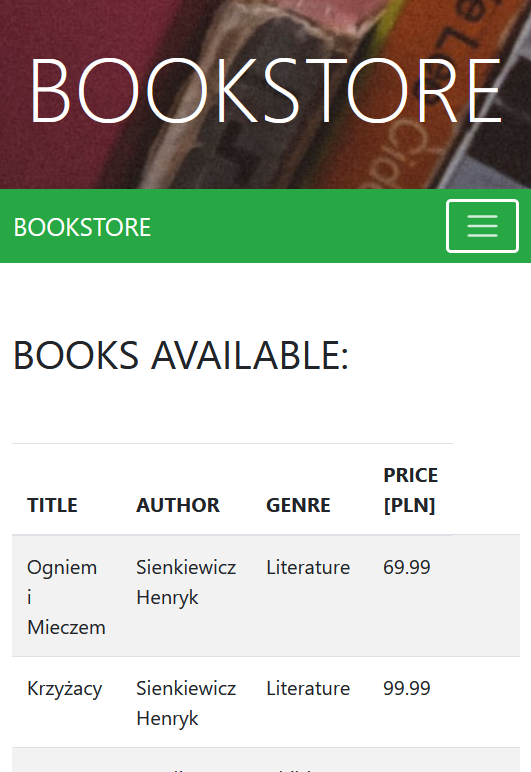

# OnlineShop

In this application I made online shop simulation. User hast to login to application to make order. Application is secured by Spring Security. I used mySQL to manage database. I used thymeleaf and bootstrap to create fronted side of application.

## Table of content
* [General info](#general-info)
* [Technologies](#technologies)
* [Setup](#setup)
* [Application](#application)

## General info
I used bootstrap and thymeleaf to create forntend. Application is  responsive. For deviced with small screen the navbar collapses and I added toggler icon with drop-down menu. There are two account at the beggining. First account is admin account and second account is user account. User can order books and admin can add, update or delete available books.
## Technologies
Project is  created with:
* SpringBoot version 2.4.3 (Spring Security, data JPA, Spring Web)
* Thymeleaf
* Bootstrap version 4.6.0
* CSS
* HTML  

## Setup
To run this project, download it to your IDE which operates Spring Boot and click run project as Spring Boot App. Open any web browser and go to localhost:8080. In application
there are two default account: 
* admin account:  
login: admin  
password: admin
* user account:   
login: user  
password: user

## Application
Below there are some pictures to demonstrate this application.

